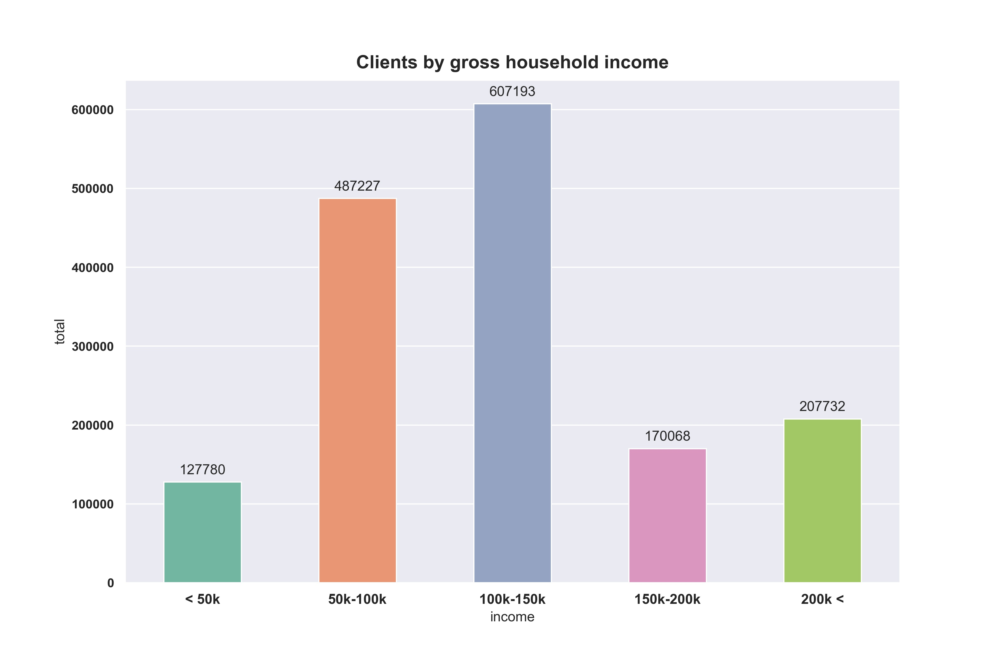
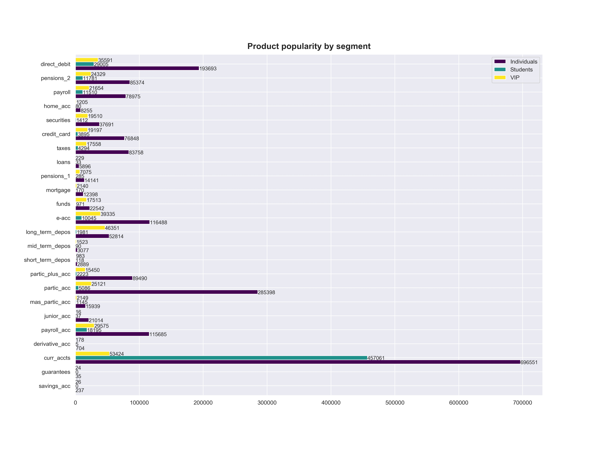

# Bank dataset visualization

## Table of Contents
* [General info](#general-info)
* [Screenshots](#screenshots)
* [Technologies](#technologies)
* [Libraries](#libraries)
* [Status](#status)
* [Sources](#sources)
* [Contact](#contact)

## General info
This Python script contains analysis of Santander bank dataset found on kaggle.com.

## Screenshots
Sample drawings:

## Technologies
* Python 3.7.4

## Libraries
* Python: pandas, geopandas, numpy, matplotlib, seaborn, os, unidecode

## Status
Project is: _finished_

## Sources
Dataset comes from: https://www.kaggle.com/c/santander-product-recommendation/data

## Contact
maciej.wilk04@gmail.com
